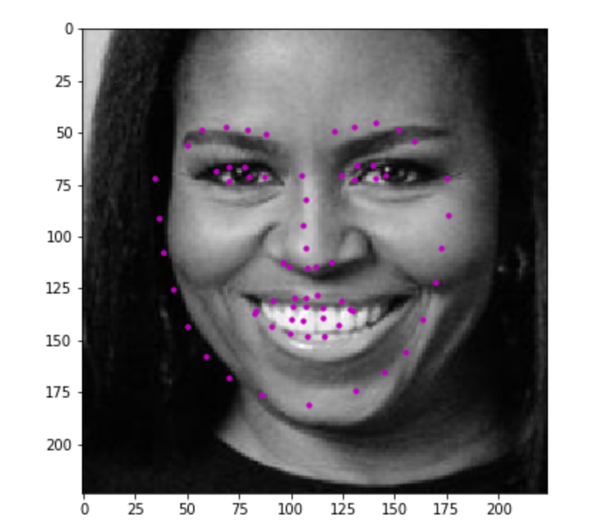
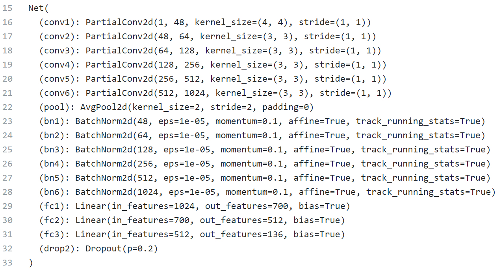

# facial-keypoint-detection
Facial keypoint detection CNN - custom architecture using partial convolution padding.  This is part of the Udacity computer vision nanodegree, and was quite a fun project!

Example result:

# Facial Keypoint Detection
This project will be all about defining and training a convolutional neural network to perform facial keypoint detection, and using computer vision techniques to transform images of faces. The first step in any challenge like this will be to load and visualize the data you'll be working with.

# Architecture:

